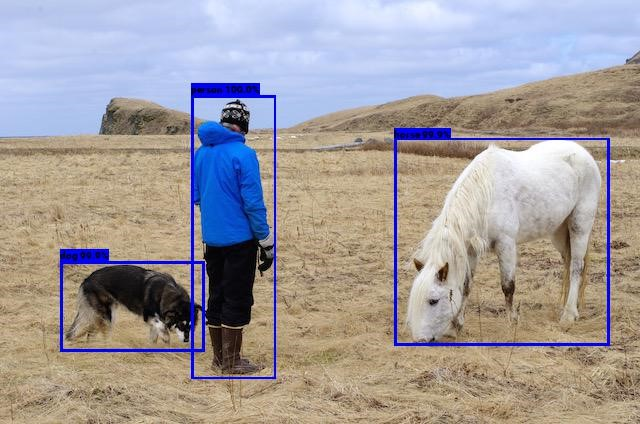
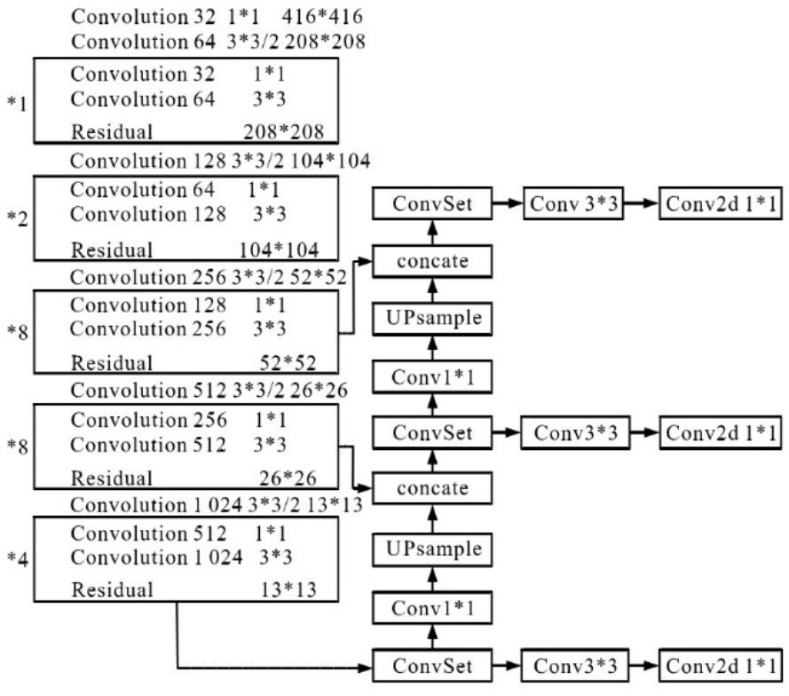

# AMD_SummerSchool2022-Vitis-AI
Campus-WalkerCam: Multi-object Detection System

* Author : 
* Enlish name : Calvin Shi, Hao Ren
* Chinese name: 时凯胜，任昊
* Team: AMD_SummerSchool2022 of 7th team
* University: Shaanxi University of Science ＆ Technology
* Participated Adaptive Computing Challenge 2021

Campus-WalkerCam:  Multi-object Detection System based on YOLOv3 on KV260

* # Overview 

"Campus-WalkerCam" is a real-time Multi-object detection system dedicated to campus roads. This project implements Multi-object detection system based on Yolov3 on the KV260 development board. The "Campus-WalkerCam" project uses a self-made dataset for training and The test data set uses the campus road environment as the detection environment, and uses Yolov3 as the customized multi-target detection algorithm to realize the real-time detection system of pedestrian targets on the campus road.

* # Things
Hardware components
AMD-Xilinx Kria KV260 Vision AI Starter Kit
A laptop with an Nvidia graphics card (RTX2060)
A DP monitor
Several network cables
Software apps and online services
AMD-Xilinx Vitis Unified Software Platform
VMware Station pro 16
Ubuntu18.04
Vitis AI 1.4
Balena Etcher tool 

* # Background
Campus security has always been a very important thing. Schools often place cameras in important places. The cameras will always run and monitor some people or things in important areas. With the evolution of artificial intelligence algorithms, smart engineers and scholars have developed multi-target detection and recognition algorithms, among which the YOLO series algorithms are the most prominent type of AI algorithms. This project "Campus-WalkerCam" is a real-time detection system for pedestrians and vehicles on campus roads.
Xilinx provides the Vitis series of EDA development software and the Vitis-AI package, as well as IVAS (a new intelligent video analysis software framework) that we can use to run traffic sign recognition applications. In the following, we will show how to use the YOLOV3 network to customize a YOLOV3-based multi-target detection hardware acceleration system for pedestrians and vehicles, and run it on the Kria KV260 board.

* # Introduction to YOLO Algorithm
The author of YOLO is Joseph Redmon. The paper was published in CVPR2016, and the target detection paper "You Only Look Once: Unified, Real-Time Object Detection". The authors emphasize a single-stage model.
The single-stage YOLO [1, 2, 3] series of detection networks integrates target localization and recognition, which is faster but slightly less accurate than the two-stage network. In order to improve the accuracy of detection, the structure of the YOLO series network gradually tends to be irregular and complicated, and the network depth is also increasing. YOLOv1 includes three convolutional layers with different convolution kernel sizes, as well as pooling layers and fully connected layers; YOLOv2 cancels the storage-intensive fully connected layers, and directly passes the reordered high-dimensional feature maps to deeper layers The extraction of fine-grained features is realized, but the irregularity of the model structure also increases; YOLOv3 mainly introduces the residual mechanism and realizes multi-scale prediction through upsampling, but the network depth has exceeded 100 layers, and the structure is more complex. The computation and memory requirements during inference are larger.

This project uses the YOLOV3 algorithm as a multi-target detection algorithm. Experiments have shown that when YOLOV3 and YOLOV3 detect objects on KV260, the former is slower and more accurate than the latter. Since "Campus-WalkerCam" does not require high speed, but requires higher accuracy, YOLOv3 is selected as the detection network of "Campus-WalkerCam". The following figure is the network structure diagram of YOLOV3.

* Reference paper:Redmon, Joseph, and Ali Farhadi. “Yolov3: An incremental improvement.” arXiv preprint arXiv:1804.02767 (2018).

Introduction to Kria KV260 Vision AI and related

AMD-Xilinx released the Kria Adaptive Module SOM in 2021, which makes hardware-accelerated application development and application deployment easier. In the hardware application development of this project, Kria KV260 Vision AI Starter Kit, Kria™ Apps on the Xilinx App Store, Kria™ K26 SOM are mainly used, among which the most important for this project is IVAS (a new intelligent video analysis software framework ), the reference content can be read Mario Bergeron's article "Introducing Xilinx Kria™ for Vision AI Applications", web link: https://www.hackster.io/AlbertaBeef/introducing-xilinx-kria-for-vision-ai-applications-819148#overview
AMD-Xilinx® Vitis™ AI is a development kit for AI inference on AMD-Xilinx hardware platforms. It consists of optimized DPU IP cores, AI libraries, AI Profiler, AI Quantizer and AI Optimizer tools, AI Model Zoo pre-optimized models. It was designed with efficiency and ease of use in mind, fully exploiting the potential of AI acceleration on Xilinx FPGAs and ACAPs. Currently KV260 AI-model supports YOLOV2, YOLOV3, FACEDETECT, CLASSFICATION, SSD, REID, REFINEDET, TFSSD.

* # Content of “Campus-WalkerCam”

AMD-Xilinx provides Vitis series EDA development software and Vitis-AI package, and IVAS (a new intelligent video analysis software framework), which we can use to run Campus-WalkerCam. In the following we will show how to implement the "Campus-WalkerCam".
Please prepare in advance to configure the GPU environment, ubuntu18.04 and virtual machine on the computer.
* # Custom dataset and training

First, collect the image data set of campus vehicles and people, and make it into the format of VOC data set, and train the YOLOV3 network according to the method in the article "[YOLOv3] Train yolov3 on VOC".
Please refer to the author yaoyz105's "[YOLOv3] Train yolov3 on VOC", article link: https://blog.csdn.net/qq_31347869/article/details/88075446

* # Configure the Viis-AI runtime environment
Please install VMware Station Pro software on your computer first, and install Ubuntu18.04 and Vitis2020.2 packages on VMware Station Pro, and then download and install Vitis-AI 1.4. For specific details, please refer to the reference link: https://github.com/Xilinx/Vitis-AI/tree/master/docs
First download and unzip Vitis-AI 1.4, download link: https://github.com/Xilinx/Vitis-AI/archive/refs/tags/v1.4.tar.gz
After unpacking, rename Vitis AI 1.4, 
Installation for Vitis AI 1.4，Code:
--
cd Vitis AI 1.4
docker pull xilinx/vitis-ai-cpu:1.4.916
./docker_run.sh xilinx/vitis-ai-cpu:1.4.916
--
The following screen will appear:

Later steps need to be run on TensorFlow 1.15 Workflows
Command Line：
--
conda activate vitis-ai-tensorflow
--
The following screen will appear:

* # Converting parameter formats using DW2TF projects

Download DW2TF on Ubuntu18.04, extract it in /Vitis AI 1.4/pre_project, rename Darknet2Tensorflow, create /Vitis AI 1.4/pre_project/Darknet2Tensorflow/data/yolov3 and Darknet2Tensorflow/yolov3 folders, open the yolov3 file Folder into yolov3.cfg and yolov3.weights, and put the generated yolov3.weights in the DW2TF folder
First make changes to Darknet2Tensorflow/mian.py. The modified code is as follows:
--
# -*- coding: utf-8 -*-

from __future__ import absolute_import
from __future__ import division
from __future__ import print_function

from argparse import ArgumentParser

import os
import tensorflow as tf

from util.cfg_layer import get_cfg_layer
from util.reader import WeightsReader, CFGReader

def parse_net(num_layers, cfg, weights, training=False, const_inits=True, verbose=True):
    net = None
    counters = {}
    stack = []
    cfg_walker = CFGReader(cfg)
    weights_walker = WeightsReader(weights)
    output_index = []
    num_layers = int(num_layers)

    for ith, layer in enumerate(cfg_walker):
        if ith > num_layers and num_layers > 0:
            break
        layer_name = layer['name']
        counters.setdefault(layer_name, 0)
        counters[layer_name] += 1
        scope = "{}{}{}".format(args.prefix, layer['name'], counters[layer_name])
        net = get_cfg_layer(net, layer_name, layer, weights_walker, stack, output_index, scope,
                            training=training, const_inits=const_inits, verbose=verbose)
        # Exclude `net` layer from stack (for correct layer indexing)
        # See https://github.com/jinyu121/DW2TF/issues/30
        # See https://github.com/AlexeyAB/darknet/issues/487#issuecomment-374902735
        if layer['name'] != 'net':
            stack.append(net)
        if verbose:
            print(ith, net)

    if verbose:        
        for ind in output_index:
            print("=> Output layer: ", stack[ind])

def main(args):
    ckpt_path = os.path.join(args.output, os.path.splitext(os.path.split(args.cfg)[-1])[0] + ".ckpt")
    pb_path = os.path.join(args.output, os.path.splitext(os.path.split(args.cfg)[-1])[0] + ".pb")

    # ----------------------------------------------------------
    # Save temporary .ckpt from graph containing pre-trained
    # weights as const initializers. This is not portable as
    # graph.pb or graph.meta is huge (contains weights).
    # ----------------------------------------------------------
    tf.reset_default_graph()
    parse_net(args.layers, args.cfg, args.weights, args.training)
    graph = tf.compat.v1.get_default_graph()

    saver = tf.compat.v1.train.Saver(tf.compat.v1.global_variables())
    with tf.compat.v1.Session(graph=graph) as sess:
        sess.run(tf.compat.v1.global_variables_initializer())
        saver.save(sess, ckpt_path, write_meta_graph=False)

    # ----------------------------------------------------------
    # Save .pb, .meta and final .ckpt by restoring weights
    # from previous .ckpt into the new (compact) graph.
    # ----------------------------------------------------------
    tf.reset_default_graph()
    parse_net(args.layers, args.cfg, args.weights, args.training, const_inits=False, verbose=False)
    graph = tf.compat.v1.get_default_graph()

    with tf.io.gfile.GFile(pb_path, 'wb') as f:
        f.write(graph.as_graph_def(add_shapes=True).SerializeToString())
    print("Saved .pb to '{}'".format(pb_path))

    with tf.compat.v1.Session(graph=graph) as sess:
        # Load weights (variables) from earlier .ckpt before saving out
        var_list = {}
        reader = tf.compat.v1.train.NewCheckpointReader(ckpt_path)
        for key in reader.get_variable_to_shape_map():
            # Look for all variables in ckpt that are used by the graph
            try:
                tensor = graph.get_tensor_by_name(key + ":0")
            except KeyError:
                # This tensor doesn't exist in the graph (for example it's
                # 'global_step' or a similar housekeeping element) so skip it.
                continue
            var_list[key] = tensor
        saver = tf.compat.v1.train.Saver(var_list=var_list)
        saver.restore(sess, ckpt_path)

        saver.export_meta_graph(ckpt_path+'.meta', clear_devices=True, clear_extraneous_savers=True)
        print("Saved .meta to '{}'".format(ckpt_path+'.meta'))

        saver.save(sess, ckpt_path, write_meta_graph=False)
        print("Saved .ckpt to '{}'".format(ckpt_path))

if __name__ == "__main__":
    parser = ArgumentParser()
    parser.add_argument('--cfg', default='data/network.cfg', help='Darknet .cfg file')
    parser.add_argument('--weights', default='data/network.weights', help='Darknet .weights file')
    parser.add_argument('--output', default='data/', help='Output folder')
    parser.add_argument('--prefix', default='network/', help='Import scope prefix')
    parser.add_argument('--layers', default=0, help='How many layers, 0 means all')
    parser.add_argument('--gpu', '-g', default='', help='GPU')
    parser.add_argument('--training', dest='training', action='store_true', help='Save training mode graph')
    args = parser.parse_args()

    # Set GPU to use
    os.environ["CUDA_VISIBLE_DEVICES"] = ",".join(args.gpu)
    # Filter out TensorFlow INFO and WARNING logs
    os.environ["TF_CPP_MIN_LOG_LEVEL"]="2"

    main(args)
--
Then enter the following code to complete the conversion of the Darknet parameter file to the parameter asking price of Tensorflow.
--
python3 main.py -h
python3 main.py \
    --cfg 'data/yolov3/ yolov3.cfg' \
    --weights 'data/yolov3/ yolov3.weights' \
    --output 'data/' \
    --prefix 'yolov3/' \
--gpu 0
--
At this point, checkpoint, yolov3.ckpt.data-00000-of-00001, yolov3.ckpt.index, yolov3.ckpt.meta, yolov3.pb will be generated, as shown in the following figure:

* # Build a frozen graph
Check out Chapter 3: Quantizing the Model of ug1414-vitis-ai.pdf, and prepare the following three files before running vai_q_tensorflow.

The command to build the frozen graph is as follows:

Let's start building the frozen graph:

First, check the structure of the Yolov3 network in this project through https://netron.app/, open yolov3.pb, and you can see the following screen:

The first layer of the network shows: yolov3-416/net1

The last layer of the network shows: yolov3-416/convolutional75/BiasAdd
Create a new folder /Vitis AI 1.4/pre_project/Darknet2Tensorflow/yolov3/convolutional75/BiasAdd and enter the following command to generate frozen_graph.pb.
--
freeze_graph --input_graph yolov3/yolov3.pb --input_checkpoint yolov3/yolov3.ckpt --output_graph frozen/frozen_graph.pb --output_node_names  yolov3-416/convolutional75/BiasAdd --input_binary true
--

After the above steps you will get frozen_graph.pb

* # Quantize
According to Chapter 3: Quantizing the Model of ug1414-vitis-ai.pdf, the quantization process for running vai_q_tensorflow is shown in the figure.

To run quantization on tensorflow, prepare frozen_graph.pb, input_fn, input_nodes, and output_nodes in advance, where frozen_graph.pb is the previously frozen network structure, input_fn can perform image preprocessing, input_nodes is the name list of the input quantization starting point of the quantization graph, output_nodes is a list of names of input quantization endpoints for the quantization graph.
Here you need to build calibration.py, the code here refers to hdcoe's article "Running Yolov2-tiny on KV260", first prepare the calibration dataset VOC2007/IPEGImages, and put the VOC dataset into the Vitis-AI 1.4/data/ folder inside. The calibration.py script modifies dataset_path, inputsize, and input_node according to this project.
It can also be rewritten according to the pseudo-code example in the following figure:

* # calibration.py of Code：
--
import os
import cv2
import glob
import numpy as np

# set data path to your own dataset
dataset_path = "/workspace/data/VOCdevkit/VOC2007/JPEGImages" 

# set input size 
inputsize = {'h': 416, 'c': 3, 'w': 416}

# set input node name
input_node = "yolov3-416/net1"

calib_batch_size = 10

def convertimage(img, w, h, c):
    new_img = np.zeros((w, h, c))
    for idx in range(c):
        resize_img = img[:, :, idx]
        resize_img = cv2.resize(resize_img, (w, h), cv2.INTER_AREA)
        new_img[:, :, idx] = resize_img
    return new_img

# This function reads all images in dataset and return all images with the name of inputnode
def calib_input(iter):
    images = []
    line = glob.glob(dataset_path + "/*.j*") # either .jpg or .jpeg
    for index in range(0, calib_batch_size):
        curline = line[iter * calib_batch_size + index]
        calib_image_name = curline.strip()
        image = cv2.imread(calib_image_name)
        image = convertimage(image, inputsize["w"], inputsize["h"], inputsize["c"])
        image = image / 255.0
        images.append(image)
return {input_node: images}  # first layer
--
calibration.py中有三处可以根据cfg文件进行修改
# set data path to your own dataset
dataset_path = "/workspace/data/VOCdevkit/VOC2007/JPEGImages" 

# set input size 
inputsize = {'h': 416, 'c': 3, 'w': 416}

# set input node name
input_node = "yolov3/net1"

It runs the following commands to quantify the model:
 
In this project, enter the following commands under the docker of Vitis AI 1.4:
--
vai_q_tensorflow quantize --input_frozen_graph frozen/frozen_graph.pb --input_fn calibration.calib_input --output_dir quantize/ --input_nodes yolov3-416/net1 --output_nodes yolov3-416/convolutional75/BiasAdd --input_shapes ?,608,608,3 --calib_iter 100
--
Then the following image appears:

Finally generate quantize_eval_model: quantize/quantize_eval_model.pb

Compile the network model of Campus-WalkerCam

This project uses the Vitis™ AI Compiler (VAI_C), VAI_C acts as a unified interface for a family of compilers dedicated to performing optimizations on neural network computations for the DPU family, each compiler can map a single network model to a single highly optimized DPU instruction sequence. The XIR toolchain can perform more efficient DPU compilation and deployment on the FPGA.
According to Chapter 5: Compilling the Model of ug1414-vitis-ai.pdf, the project compilation under Tensorflow needs to prepare quantize_eval_model.pb, arch.json, and finally get netname_org.xmodel, meta.json and md5sum.txt. The statement used is as follows:

--
{
    "fingerprint":"0x1000020F6014406"
}
--
The statement used in this project is as follows:
--
vai_c_tensorflow --frozen_pb quantize/quantize_eval_model.pb -a arch.json -o yolov3 -n yolov3
--
Then you will see the image below, and generate yolov3.xmodel, md5sum.txt, meta.json.

Due to the later discovery that yolov3 has some problems in training, it is necessary to design the network, retrain and obtain parameters corresponding to the operator, in order to be able to achieve multi-object detection algorithm acceleration on KV260, due to the tight time, here choose to use AI-Model-Zoo for "Campus-WalkerCam", the application selects "dk_yolov3_voc_416_416_65.42G_1.4" as the algorithm network.
First download "dk_yolov3_voc_416_416_65.42G_1.4" from AI-Model-Zoo "yolov3_voc-zcu102_zcu104_kv260-r1.4.0.tar.gz" and "dk_yolov3_voc_416_416_65.42G_1.4.zip", And unzip these two files to get "deploy.caffemodel" under the quantized folder and "yolov3_voc.prototxt" under the yolov3_voc folder.
Then we need to generate the xmodel file. Open the docker image of vitis-ai-caffe and perform the format conversion. Enter the following statement:
--
sudo ./docker_run.sh xilinx/vitis-ai-cpu:1.4.916
vai_c_caffe -p ./deploy.prototxt -c deploy.caffemodel -a arch.json
--
就可以看见以下画面：

经过几分钟等待就可以生成xmodel文件和看到下面画面：

And the deeploy.xmodel and the deeploy.prototxt were renamed yolov3-voc.xmodel and yolov3-voc.prototxt.
Building applications on KV260
The configuration files required to build a KV260 application include aiinference.json, preprocess.json, drawresult.json, deploy.prototxt, deploy.xmodel, label.json.
Adding new files and directories on a running KV260 looks like this:
/opt/Xilinx/share/vitis_ai_library/models/kv260-smartcam/Campus-WalkerCam/
    --yolov3-voc.xmodel
    -- yolov3-tiny.prototxt
    --label.json
/opt/Xilinx/share/ivas/smartcam/Campus-WalkerCam/
    --preprocess.json
    --drawresult.json
--aiinference.json

See "Customizing the AI Models used in the application",
Web links: 
https://xilinx.github.io/kria-apps-docs/2020.2/build/html/docs/smartcamera/docs/customize_ai_models.html
The specific code is as follows:
preprocess.json of Code:

--
{
  "xclbin-location":"/lib/firmware/xilinx/kv260-smartcam/kv260-smartcam.xclbin",
  "ivas-library-repo": "/opt/xilinx/lib",
  "kernels": [
    {
      "kernel-name": "pp_pipeline_accel:pp_pipeline_accel_1",
      "library-name": "libivas_xpp.so",
      "config": {
        "debug_level" : 1,
        "mean_r": 0,
        "mean_g": 0,
        "mean_b": 0,
        "scale_r": 0.25,
        "scale_g": 0.25,
        "scale_b": 0.25
      }
    }
  ]
}
--
drawresult.json of Code:
This file draws objects in different colors during detection.
--
{
  "xclbin-location":"/usr/lib/dpu.xclbin",
  "ivas-library-repo": "/opt/xilinx/lib",
  "element-mode":"inplace",
  "kernels" :[
    {
      "library-name":"libivas_airender.so",
      "config": {
        "fps_interval" : 10,
        "font_size" : 2,
        "font" : 1,
        "thickness" : 2,
        "debug_level" : 0,
        "label_color" : { "blue" : 0, "green" : 0, "red" : 255 },
        "label_filter" : [ "class", "probability" ],
        "classes" : [
                {
                "name" : "person",
                "blue" : 255,
                "green" : 0,
                "red" : 0
                },
                {
                "name" : "car",
                "blue" : 0,
                "green" : 255
                "red" : 0
                },
                ]
        }
    }
]                
}
--
aiinference.json of Code:
--
{
  "xclbin-location":"/lib/firmware/xilinx/kv260-smartcam/kv260-smartcam.xclbin",
  "ivas-library-repo": "/usr/lib/",
  "element-mode":"inplace",
  "kernels" :[
    {
      "library-name":"libivas_xdpuinfer.so",
      "config": {
        "model-name" : "Campus-WalkerCam",
        "model-class" : "YOLOV3",
        "model-path" : "/home/petalinux",
        "run_time_model" : false,
        "need_preprocess" : false,
        "performance_test" : false,
        "debug_level" : 1
      }
    }
  ]
}
--
Yolov3-tny.prototxt of Code :
Here "biases" corresponds to the size of the network configuration file anchors, see the network configuration file for details.
--
model {
  name: "Campus-WalkerCam"
  kernel {
     name: "yolov3"
     mean: 0.0
     mean: 0.0
     mean: 0.0
     scale: 0.00390625
     scale: 0.00390625
     scale: 0.00390625
  }
  model_type : YOLOv3
  yolo_v3_param {
    num_classes: 20
    anchorCnt: 3
    layer_name: "81"
    layer_name: "93"
    layer_name: "105"
    conf_threshold: 0.3
    nms_threshold: 0.45
    biases: 10
    biases: 13
    biases: 16
    biases: 30
    biases: 33
    biases: 23
    biases: 30
    biases: 61
    biases: 62
    biases: 45
    biases: 59
    biases: 119
    biases: 116
    biases: 90
    biases: 156
    biases: 198
    biases: 373
    biases: 326
    test_mAP: false
  }
}--

* # Running Campus-WalkerCam on KV260
Running Campus-WalkerCam with video files
The video file is encoded in H264. First, install ffmpeg on Ubuntu. The code is as follows:
Install the dependency library first:

sudo apt-get -y install autoconf automake build-essential libass-dev libfreetype6-dev libsdl2-dev libtheora-dev libtool libva-dev libvdpau-dev libvorbis-dev libxcb1-dev libxcb-shm0-dev libxcb-xfixes0-dev pkg-config texinfo zlib1g-dev
Install the assembly library
--
sudo apt-get install yasm
sudo apt-get install nasm
--
Install video library
To support video processing such as X264, you need to install the corresponding library:
--
sudo apt-get install libx264-dev
sudo apt-get install libx265-dev
--
Installation to Ffmpeg
To install through source code, you need to download the latest source code first:
--
cd ~/ffmpeg
wget http://ffmpeg.org/releases/ffmpeg-snapshot.tar.bz2
tar xjvf ffmpeg-snapshot.tar.bz2
cd ffmpeg
--
After downloading, you can install it, take the installation in /opt/ffmpeg as an example
--
./configure --prefix=/opt/ffmpeg --enable-libx264 --disable-yasm --enable-nonfree --enable-libfdk-aac  --enable-shared --enable-gpl --enable-libmp3lame --enable-libopus  --extra-cflags=-I/usr/local/include --extra-ldflags=-L/usr/local/lib
--
make
--
make install
--

Configure the library
Configure the path where the library is located so that FFmpeg can load the corresponding library. Open the configuration file sudo gedit /etc/ld.so.conf and add a line of library path:
--
/opt/ffmpeg/lib
--
Then execute sudo ldconfig to reload the configuration to take effect.

path configuration

In order to use FFmpeg at any time, the corresponding directory needs to be added to the path. Open the configuration file gedit ~/.profile and add:
--
FFMPEG=/opt/ffmpeg
PATH="$PATH:$FFMPEG/bin"
source ~/.profile
--
Verify after configuration is complete
Enter ffmpeg and the following image appears.

Then convert the video in MP4 format to video in H264 format, enter the command as follows;
--
ffmpeg -i input-video.mp4 -c:v libx264 -pix_fmt nv12 -vf scale=1920:1080 -r 30 output.nv12.h264
--
The input command to run the Campus-WalkerCam application on the KV260 is as follows:
--
sudo dnf update
sudo dnf clean all
sudo xmutil getpkgs
sudo dnf install packagegroup-kv260-smartcam.noarch
sudo xmutil      listapps
sudo xmutil      unloadapp
sudo xmutil      loadapp kv260-smartcam
sudo smartcam -f ./output.h264 -i h264 -W 1920 -H 1080 -r 30 -t dp –a Campus-WalkerCam
--
Running Campus-WalkerCam with MIPI camera
The input command to run the Campus-WalkerCam application on the KV260 is as follows:
--
sudo smartcam --mipi -W 1920 -H 1080 -r 30 -t dp –a Campus-WalkerCam
--

demo 

Demo video link: https://www.bilibili.com/video/BV1rY4y1v7jK/
Code
	Github 
https://github.com/calvinee/Campus-WalkerCam
